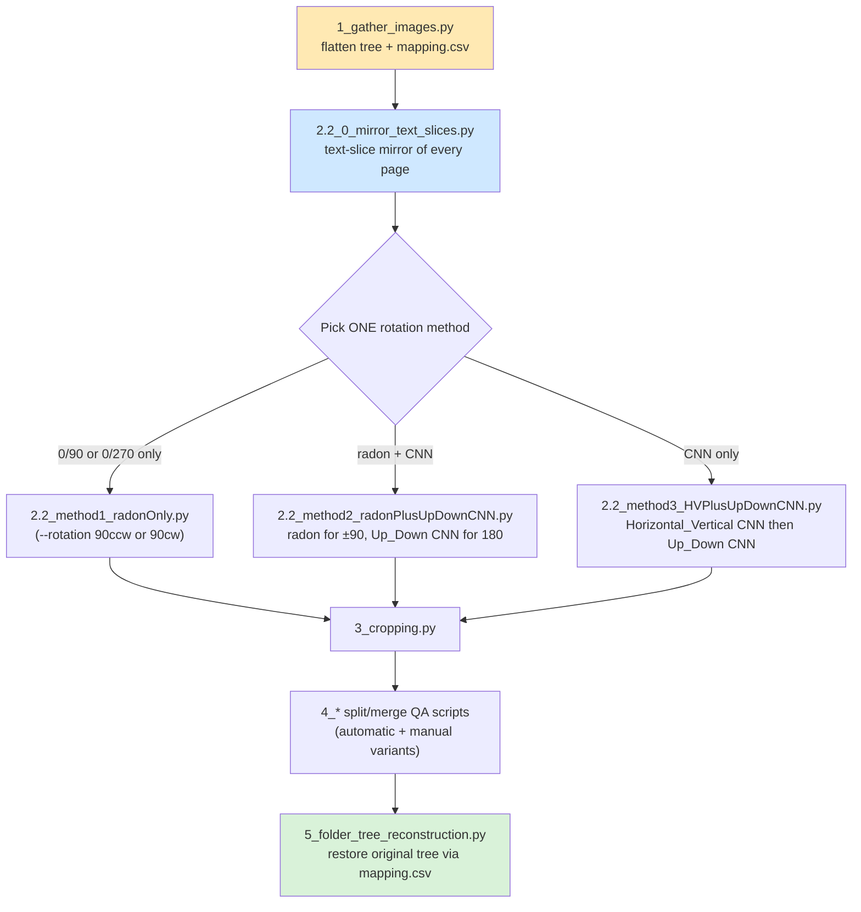

# ❗❗Updated repo branch👇

This branch is used during the remediation task. However, updates were made afterwards for the IJDC paper submission.
For the code base referred in the IJDC submission, select the **"IJDC_ready"** branch.

# ❓ What is this

This repository includes a workflow that addresses common problems digital libraries encounter when archiving **images of corpora**. The common problem types are:
1. Rotation correction in multiples of 90 degrees.
2. Cropping the images so that a small fraction, or none, of the background remains.
3. Safely splitting images into two, in case the image set contains two-pagers.

The code is not wrapped in a UI yet, but the functionalities are all present (of course, future updates will be expected), even including QA and evaluation methods.
This workflow uses ⚙️methods⚙️ such as
1. CNN categorization (MobileNetV2 binary classifiers),
2. a 1D projection-band text detector,
3. Radon transform,
4. Fourier transform,
5. adaptive binarization,
6. opening & closing,
7. edge detection.

Every script is named after the step it implements, so following the workflow
means running the files in prefix order (`1_`, `2.1_`, `2.2_0_`, `2.2_method1/2/3`,
`3_`, `4_*`, `5_`). All scripts accept `--help`, prompt you for missing required
arguments, scale their threading to your CPU core count, and write CSV reports
next to the data they touch.

# ⚙️ Requirements & how to run

* **Python 3.10** — the workflow must be run with Python 3.10.
* **Anaconda Prompt in Administrator mode** — open Anaconda Prompt by
  right-clicking it and choosing *Run as administrator* (the file-moving,
  rotation and watchdog steps need the elevated permissions on Windows),
  then run every script from the repository folder inside that prompt.

Set the environment up once (in the Administrator Anaconda Prompt):

```
conda create -n ml_image_tool python=3.10
conda activate ml_image_tool
pip install -r requirements.txt
```

All third-party packages (numpy, opencv-python, tensorflow, scikit-image,
Pillow, watchdog, tqdm, augraphy) are listed with explanations in
[`requirements.txt`](requirements.txt).

# 🚦 Step 0 — BACK UP FIRST

**Make a complete copy of your original folder tree before running anything.**
`1_gather_images.py` shows this warning and asks for confirmation on every run —
it *moves* your files by default (`--mode copy` keeps the originals if you prefer).

# 📄 The workflow



## Main pipeline (required steps)

| # | Script | What it does / what you must decide |
|---|--------|--------------------------------------|
| 0+1 | `1_gather_images.py` | Flattens the source tree into numbered folders (`0`, `1`, …) of at most **2¹³ = 8,192 files** each (override with `--max-per-folder`), renames images to `<folder>@@!!!!!!@@<index><ext>`, and logs every old→new location into `mapping.csv` (consumed by step 14). Blocks until you confirm you have a backup. |
| 8 | `2.2_0_mirror_text_slices.py` | Re-uses the `2.1_slice_text_square.py` algorithm + `2.1_best_projection_band_2.keras` to store the **best 256×256 text patch** of every page as `<mirror>/<same sub-path>/<stem>.png`. Pages with no convincing text patch are **not** mirrored (logged in `mirror_manifest.csv`) — the rotation methods cannot touch those, so rotate them manually. Re-running skips already-mirrored files. |
| 9 | `2.2_method1_radonOnly.py` | **Rotation option 1.** Radon detection on the mirror slices; every HORIZONTAL page is rotated **90 CCW or 90 CW — you choose with `--rotation`** (the script prints a prominent notice; radon cannot tell +90 from −90). Slice and original are always rotated together. Use only for corpora that contain 0/90 or 0/270 rotations. |
| 10 | `2.2_method2_radonPlusUpDownCNN.py` | **Rotation option 2.** Phase 1: radon turns every ±90 page into 0/180 via a fixed 90 CCW turn. Phase 2: `2.2_Up_Down.keras` flips detected upside-down pages by 180. Same mirror-lookup pairing as option 1. |
| 11 | `2.2_method3_HVPlusUpDownCNN.py` | **Rotation option 3.** Phase 1: `2.2_Horizontal_Vertical.keras` detects ±90 pages → fixed 90 CCW turn. Phase 2: `2.2_Up_Down.keras` fixes 180. Both decisions by CNN, batch-predicted with the `2.1_CNN_Test.py` preprocessing. |
| 12 | `3_cropping.py` | Removes the dark background around the (brighter) page with Otsu + morphology + contours, keeping a safety margin (`--safe-denominator`, default 95). Crops in place by default; `--save` writes elsewhere. Problem images are moved to an error folder. |
| 13 | `4_*` scripts | Split/merge QA for two-page scans — **see the dedicated section below**. |
| 14 | `5_folder_tree_reconstruction.py` | Reads `mapping.csv` and moves every file back to its original location. Reports missing files and "leftovers" (split halves) it does not know about; optionally collects leftovers with `--leftovers-dest`. Supports `--dry-run`. |

## Optional training-data preparation (steps 2–7, `2.1_*`)

Run these only when you want to (re)train or fine-tune the two `2.2_*` CNNs.
Steps 2, 3, 4 and 6 can run concurrently.

| # | Script | Purpose |
|---|--------|---------|
| 2 | `2.1_text_slice_generatorV2.py` | Generates artificial text slices for training (config at the top of the file). |
| — | `2.1_text_slice_augmentation.py` | Augraphy-based augmentation of the generated slices. |
| 3 | `2.1_to_jpg.py` | Batch-converts the RVL-CDIP download to jpg, preserving the layout. |
| 4 | `2.1_slice_text_square.py` | **The slicing algorithm** (single source of truth; the step-8 mirror imports it). Run it on the RVL jpgs to harvest text patches; `--model` now defaults to the workspace `2.1_best_projection_band_2.keras`. |
| 5 | `2.1_sample_selection.py` | Takes every n-th image (or `_r` pair) of the flattened corpus as a training/fine-tuning sample. |
| 6 | `2.1_slice_text_square.py` | …then slice that sample the same way. |
| 7 | `2.1_fix_CNN.py` | One-off repair: rebuilds the MobileNetV2 binary-CNN recipe and transfers the weights (fixes `training=True` graphs and legacy saves that Keras 3 refuses to load). |
| — | `2.1_CNN_train.py` | **Full training** (from scratch) of either binary CNN — `--mode hv` (HorizontalText=0 vs VerticalText=1) or `--mode ud` (0Degree=0 vs 180Degree=1), chosen by flag or interactive prompt. Labels are pinned explicitly, never by alphabetical folder order. |
| — | `2.1_CNN_Test.py` | **Calibrate/validate** a binary CNN on slices of known orientation; also demonstrates the exact preprocessing + class semantics the rotation methods use. |
| — | `2.1_CNN_finetune.py` | Fine-tunes `2.2_Horizontal_Vertical.keras` / `2.2_Up_Down.keras` from class folders `0/` and `1/`. No flip/rotate augmentation (it would corrupt the labels). |
| — | `2.1_retrieve_h5_param.py` | Inspects any checkpoint (shapes, params, class legend). |
| — | `2.2_radonMethod_successRate_test.py` | Parameter tuning / success-rate benchmark for the radon detector. |
| — | `workflow_common.py` | Shared helpers (not a step): the smart model loaders, image IO, batch scoring, mirror-lookup and paired-rotation utilities. |

## 🧠 The models and what their outputs mean

All three checkpoints ship **inside this repository** and load automatically
(they are legacy HDF5 payloads with a `.keras` extension; `workflow_common.py`
transparently handles them, including rebuilding the MobileNetV2 recipe for
the two CNNs whose graphs contain TFOpLambda layers).

| Model | Output (sigmoid, threshold 0.5) | Used by |
|-------|--------------------------------|---------|
| `2.1_best_projection_band_2.keras` | P(patch shows text lines). Input is a 256-length projection band. | `2.1_slice_text_square.py`, `2.2_0_mirror_text_slices.py` |
| `2.2_Horizontal_Vertical_retrained.keras` | `< 0.5` → **VERTICAL page** (0/180°, text lines horizontal) · `≥ 0.5` → **HORIZONTAL page** (±90°, text lines vertical). Verified empirically: 0/180° pages score ≈0.0, ±90° pages ≈1.0. | method 3 phase 1 |
| `2.2_Up_Down.keras` | `< 0.5` → **UPRIGHT** · `≥ 0.5` → **UPSIDE-DOWN** (rotate 180) | method 2 phase 2, method 3 phase 2 |

Both binary mappings are pinned by the original training recipes — the HV
recipe (`ocr_hori_vs_vert.py`, now mirrored by [`2.1_CNN_train.py`](2.1_CNN_train.py))
labels the 0/90/180/270 CCW rotations `[0,1,0,1]`, so class 1 = ±90°; the
UD recipe documents "0 = Upright, 1 = Upside". The mapping never depends on
alphabetical folder order in this repo's trainers. If a re-trained
checkpoint ever swaps labels, the rotation scripts offer `--invert-hv` /
`--invert-ud` — but calibrate first with `2.1_CNN_Test.py` on slices whose
orientation you know.

## 🔁 Mirror-lookup rotation (steps 8–11)

The mirror tree replicates the flattened layout with the same stems, so the
original of `<mirror>/0/0@@!!!!!!@@000123.png` is simply
`<flat>/0/0@@!!!!!!@@000123.<any image ext>`. Every rotation method:

1. detects the orientation **on the small mirror slice** (fast, text-focused),
2. applies the fix **to both the slice and the original**, in place,
3. writes a per-method `_report.csv` (and a `_no_slice.csv` list of originals
   that have no mirror slice → rotate those manually).

A ±90-rotated page produces slices with *vertical* text lines; the mirror
deliberately keeps those (that is how the methods recognize ±90 pages). Only
patches that do not look like text at all are skipped.

# 🤔 Why not merge all Python scripts into one automatic script?

Some steps make mistakes, so human intervention, like QA steps, needs to be done periodically. This is why step 4 has two branches, as shown in the
picture below. One of them is used to split the image, while the other one is used to merge the images that have been processed incorrectly.

# ❗ More about splitting pages

The image below shows two types of processing scripts for splitting and merging images, respectively. 

"Automatic" scripts are configured in a way so that the user only needs to drag the image in question into the processing folder, and the script will handle them one by one. You may want to use this type
of script because the computer can process the image concurrently with the user when the user is selecting images to be processed. Yes, selecting the two-
paged images are manual, and I haven't found a perfect automatic way to identify them. 

"Manual" scripts are to be used when you already know or have constructed a folder with two-page images only. Read the script comments for more information.

**You will also see** a script named "4_add_left_or_right_margin.py". This is used to add the left vertical portion of the right image to the left image and vice versa.
You may want to use this whenever the texts are too close to the central crease, or when the splitting lines are too close to the texts. After applying it, the reader
can be more confident that the cut did not accidentally split texts on the pages.

**What do you do after identifying and merging the poorly cut pages?** This online batch cropping tool is extremely fast and useful for this type of manual workflow. https://www.imgtools.co/crop-image
Remember to duplicate the images before uploading and splitting them on this website so that you can cut the left and right versions of the page at once.

---

## 📂 File Structure


